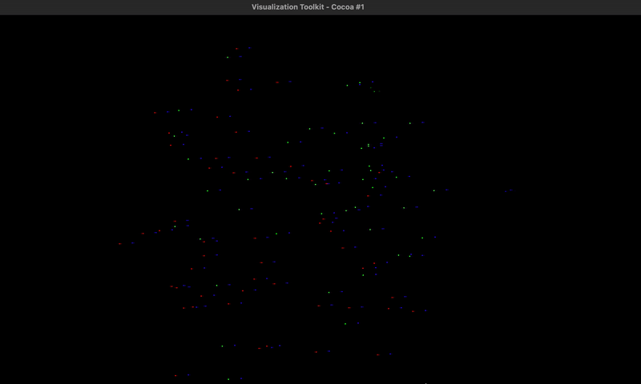

# 3D Point Cloud Registration using ICP (C++)

This project demonstrates the registration of two 3D point clouds using the Iterative Closest Point (ICP) algorithm. The implementation is written in C++ and utilizes the Point Cloud Library (PCL) for point cloud processing, Eigen for matrix operations, and VTK for visualization.

---

## Overview

- **Objective:** Align a source point cloud to a target point cloud using ICP.
- **Input:** Two `.pcd` files (`cloud1.pcd`, `cloud2.pcd`)
- **Output:** Aligned point cloud (`aligned_cloud.pcd`) and 3D visualization of all clouds.
- **Technologies:** C++17, PCL, Eigen, VTK, CMake

---

## Prerequisites

Install dependencies via [Homebrew](https://brew.sh/):

```bash
brew install pcl eigen vtk
```

The following must be present:
- A C++17-compatible compiler
- CMake 3.10 or above

---

## Build Instructions

Clone the repository and build:

```bash
git clone https://github.com/ArushiArunkumar/PointCloud_ICP.git
cd pointcloud_icp
mkdir build && cd build
cmake .. 
make
```

---

## File Structure

```
pointcloud_icp/
├── CMakeLists.txt          # Build configuration
├── icp.cpp                 # Point cloud registration using ICP
├── visualize.cpp           # Visualizes all point clouds
├── cloud1.pcd              # Source point cloud 
├── cloud2.pcd              # Target point cloud 
├── aligned_cloud.pcd       # Output after ICP alignment
└── README.md               
```

---

## Running the Program

### Step 1: Perform ICP Registration

```bash
./icp
```

This aligns the source point cloud to the target and saves the result to `aligned_cloud.pcd`.

### Step 2: Visualize Results

```bash
./visualize
```

This opens a 3D viewer with the following color scheme:
- **Red:** Original source cloud (translated for clarity)
- **Blue:** Target cloud
- **Green:** Aligned cloud

---

## Sample Output

```text
Loaded 100 source points.
Loaded 100 target points.
ICP converged.
Score: 8.18206e-14
Transformation matrix:
           1 -2.38419e-07  9.68575e-08  2.98023e-07
-1.49012e-07     0.999999 -1.04308e-07  5.36442e-07
 6.70552e-08 -8.94069e-08            1  3.57628e-07
           0            0            0            1
Aligned cloud saved to 'aligned_cloud.pcd'
```
### Visualized Output


---

## Acknowledgements

- [Point Cloud Library (PCL)](https://pointclouds.org/)
- [Eigen](https://eigen.tuxfamily.org/)
- [VTK](https://vtk.org/)
